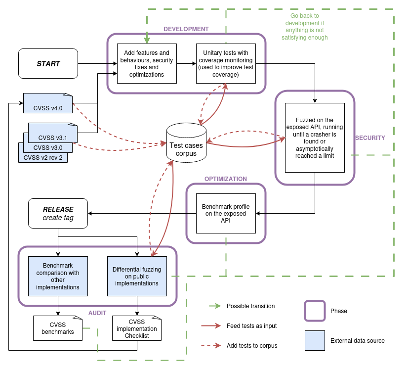
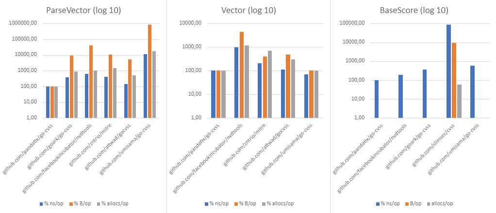
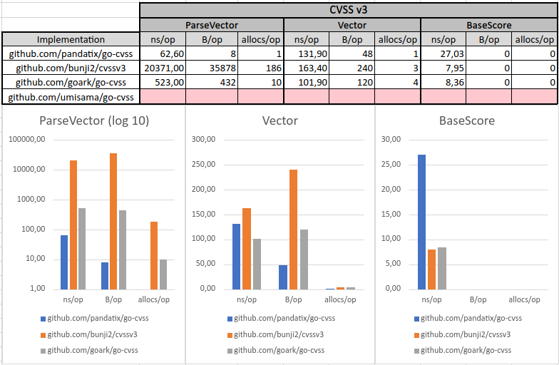

<div align="center">
	<h1>Go-CVSS</h1>
	<a href="https://pkg.go.dev/github.com/pandatix/go-cvss"></a>
	<a href="https://goreportcard.com/report/github.com/pandatix/go-cvss"></a>
	<a href="https://coveralls.io/github/pandatix/go-cvss?branch=main"></a>
	<a href=""></a>
	<br>
	<a href="https://github.com/pandatix/go-cvss/actions?query=workflow%3Aci+"></a>
	<a href="https://github.com/pandatix/go-cvss/actions/workflows/codeql-analysis.yaml"></a>
</div>

Go-CVSS is a blazing-fast, low allocations and small memory-usage Go module made to manipulate Common Vulnerability Scoring System (CVSS).

> **Note**
>
> Specified by [first.org](https://www.first.org/cvss/), the CVSS provides a way to capture the principal characteristics of a vulnerability and produce a numerical score reflecting its severity.

It currently supports :
 - [X] [CVSS 2.0](https://www.first.org/cvss/v2/guide)
 - [X] [CVSS 3.0](https://www.first.org/cvss/v3.0/specification-document)
 - [X] [CVSS 3.1](https://www.first.org/cvss/v3.1/specification-document)
 - [ ] CVSS 4.0 (currently not published)

> **Warning**
>
> It won't support CVSS v1.0, as despite it was a good CVSS start, it can't get vectorized, abbreviations and enumerations are not strongly specified, so the cohesion and interoperability can't be satisfied.

## Summary

 - [How to use](#how-to-use)
 - [How it was built](#how-it-was-built)
 - [A word on performances](#a-word-on-performances)
   - [CVSS v2.0](#cvss-v20)
   - [CVSS v3.0](#cvss-v30)
   - [CVSS v3.1](#cvss-v31)
   - [How it works](#how-it-works)
   - [Comparison](#comparison)
 - [Differential fuzzing](#differential-fuzzing)
 - [Feedbacks](#feedbacks)
   - [CVSS v2.0](#cvss-v20-1)
   - [CVSS v3.0](#cvss-v30-1)
   - [CVSS v3.1](#cvss-v31-1)

## How to use

The following code gives an example on how to use the present Go module.

It parses a CVSS v3.1 vector, then compute its base score and gives the associated rating.
It ends by printing it as the score followed by its rating, as it is often displayed.

```go
package main

import (
	"fmt"
	"log"

	gocvss31 "github.com/pandatix/go-cvss/31"
)

func main() {
	cvss31, err := gocvss31.ParseVector("CVSS:3.1/AV:N/AC:L/PR:L/UI:R/S:C/C:L/I:L/A:N")
	if err != nil {
		log.Fatal(err)
	}
	baseScore := cvss31.BaseScore()
	rat, err := gocvss31.Rating(baseScore)
	if err != nil {
		log.Fatal(err)
	}
	fmt.Printf("%.1f %s\n", baseScore, rat)
	// Prints "5.4 MEDIUM"
}
```

## How it was built

This Go module was built iteratively through time, and is represented by the following flow diagram.

<div align="center" width="800px">
	
</div>

## A word on performances

We are aware that manipulating a CVSS object does not provide the most value to your business needs.
This is why we paid a big attention to the performances of this module.

What we made is making this module **0 to 1 _allocs/op_** for the whole API.
This reduces drastically the pressure on the _Garbage Collector_, without cutting through security (fuzzing ensures the API does not contain security issues). It also reduces the time and bytes per operation to a really acceptable level.

The following shows the performances results.
We challenge any other Go implementation to do better :stuck_out_tongue_winking_eye:

### CVSS v2.0

```
goos: linux
goarch: amd64
pkg: github.com/pandatix/go-cvss/20
cpu: Intel(R) Core(TM) i5-2450M CPU @ 2.50GHz
BenchmarkParseVector_Base-4                  2635287           455.0 ns/op         4 B/op          1 allocs/op
BenchmarkParseVector_WithTempAndEnv-4         981721            1035 ns/op         4 B/op          1 allocs/op
BenchmarkCVSS20Vector-4                      1605918           632.4 ns/op        80 B/op          1 allocs/op
BenchmarkCVSS20Get-4                        68448986           17.32 ns/op         0 B/op          0 allocs/op
BenchmarkCVSS20Set-4                        45166622           27.03 ns/op         0 B/op          0 allocs/op
BenchmarkCVSS20BaseScore-4                  61978450           19.25 ns/op         0 B/op          0 allocs/op
BenchmarkCVSS20TemporalScore-4              31636566           34.57 ns/op         0 B/op          0 allocs/op
BenchmarkCVSS20EnvironmentalScore-4         20828653           56.03 ns/op         0 B/op          0 allocs/op
```

### CVSS v3.0

```
goos: linux
goarch: amd64
pkg: github.com/pandatix/go-cvss/30
cpu: Intel(R) Core(TM) i5-2450M CPU @ 2.50GHz
BenchmarkParseVector_Base-4                  2175715           514.0 ns/op         8 B/op          1 allocs/op
BenchmarkParseVector_WithTempAndEnv-4         879648            1186 ns/op         8 B/op          1 allocs/op
BenchmarkCVSS30Vector-4                      1723250           825.3 ns/op        96 B/op          1 allocs/op
BenchmarkCVSS30Get-4                        44361453           25.36 ns/op         0 B/op          0 allocs/op
BenchmarkCVSS30Set-4                        34609831           36.39 ns/op         0 B/op          0 allocs/op
BenchmarkCVSS30BaseScore-4                  32572166           37.33 ns/op         0 B/op          0 allocs/op
BenchmarkCVSS30TemporalScore-4              16464278           72.51 ns/op         0 B/op          0 allocs/op
BenchmarkCVSS30EnvironmentalScore-4         14459524           76.09 ns/op         0 B/op          0 allocs/op
```

### CVSS v3.1

```
goos: linux
goarch: amd64
pkg: github.com/pandatix/go-cvss/31
cpu: Intel(R) Core(TM) i5-2450M CPU @ 2.50GHz
BenchmarkParseVector_Base-4                  2465984           487.7 ns/op         8 B/op          1 allocs/op
BenchmarkParseVector_WithTempAndEnv-4        1059848            1248 ns/op         8 B/op          1 allocs/op
BenchmarkCVSS31Vector-4                      1276906           910.4 ns/op        96 B/op          1 allocs/op
BenchmarkCVSS31Get-4                        40836300           25.25 ns/op         0 B/op          0 allocs/op
BenchmarkCVSS31Set-4                        31707997           35.68 ns/op         0 B/op          0 allocs/op
BenchmarkCVSS31BaseScore-4                  31108681           39.70 ns/op         0 B/op          0 allocs/op
BenchmarkCVSS31TemporalScore-4              15552028           73.01 ns/op         0 B/op          0 allocs/op
BenchmarkCVSS31EnvironmentalScore-4         13541654           79.26 ns/op         0 B/op          0 allocs/op
```

### How it works

If you are looking at the internals, you'll see it's hard to read.
Indeed, this has been highly optimised, so the code is no longer easily readable.

Before continuing, the optimizations discussed later goes against the [Knuth's words](https://pic.plover.com/knuth-GOTO.pdf), but the maintenance is **our** problem, and the impacts in your code base is major for the best.

There is five major parts in this optimizations:
 1. **on-the-fly parsing** when parsing v3 vectors, meaning no buffer have to be used when parsing one. This mainly reduces the _allocs/op_ indicator for the function that did most allocations.
 2. **buffer reuse** and share when parsing v2 vectors, using a `sync.Pool` of a predetermined buffer size. This reduces the _allocs/op_ indicator for the v2 parsing function for the second function that did most allocations.
 3. **allocate-once buffer**, so that the vectorizing function counts what memory it will need then allocates and fill it. This mainly reduces the _allocs/op_ indicator for the vectorizing function. At this step, we are at 0-1 _allocs/op_, but still at 352 _B/op_ for parsing and 92 _B/op_ for vectorizing (for v3, but the same applies to v2).
 4. **information theory based optimizations**, with focus on each bit usage. This is detailed next. This finally reduces the _B/op_ indicator, leading to an highly optimized module.
 5. **cpu instructions optimizations** based on the previous. The idea is to avoid dealing with strings whenever possible and use bits. Indeed, a CPU has a native support of binary operations, while comparing strings does not (i.e. `cmpstr` take multiple cycles, but a binary shift takes one). This reduces the _n/op_ indicator.

Fortunately, those optimizations always improved (or did not affect drastically) the _ns/op_ indicator, so no balance had to be considered.

The idea behind the fourth otimization lies on the information theory : if you have an information that could be represented by a finite set of elements, meaning you can enumerate them, then you could store them using `n` bits such that `n=ceil(log2(s))` with `s` the size of this finite set.

In the case of CVSS, each attribute has its finite number of metrics with their finite set of possible values. It implies we fit in this case, so we could make it real : that's what we did.

In this module, we represent each metric set in the `values.go` file, so we enumerate them. Then, we count how many bits are necessary to store this, and use a slice of corresponding bytes (`bytes=ceil(bits/8)` with `bits` the sum of all `n`).
To determine those, we build for each version a table with those data, leading us to determine that, for instance with CVSS v3, we need `44` bits so `6` bytes.

Then, the only issue arises with implementing this idea. We define a scheme to specify what each bit is used for, and pull out hairs with bit masking and slice manipulations. Notice that it imply the vector object does not have attributes for corresponding metrics, but have some `uint8` attributes, making this hard to read.

We though of further improvements, as applying the information theory on the whole CVSS vector.
Indeed, transitively CVSS vectors have a set of finite combinations, so we could enumerate them. This would lead us to a finite set of `573308928000` combinations for v3 and `139968000` for v2, which could be respectively represented on `40` bits (`=log2(573308928000)`) that makes `5` bytes and `28` bits (`=log2(139968000)`) that still makes `4`.
This imply that CVSS v2 implementation can't be improved by this process.
Moreover, in the case of CVSS v3 we may gain a byte, but due to the undetermined order of metrics, such an implementation is trusted not maintainable and too heavy facing the loss of only a byte.

### Comparison

The following are the results of the comparison with others Go CVSS implementations, based on its own [benchmarking suite](./benchmarks).

For each metric (`% ns/op`, `% B/op`, `% allocs/op`), the result of an implementation is normalised to the result of the current module for this given metric.
This simply comparisons and shows how well it performs.

Benchmarks results for CVSS v2.
<div align="center">
	
</div>

Benchmarks results for CVSS v3.
<div align="center">
	
</div>

---

## Differential fuzzing

Using [differential fuzzing](./differential), we were able to detect various bugs and vulnerabilities.

Bug trophy list:
 - [`github.com/goark/go-cvss` #10](https://github.com/goark/go-cvss/issues/10) Improper Input Validation in CVSS v3 parsing
 - [`github.com/goark/go-cvss` #13](https://github.com/goark/go-cvss/issues/13) Another Improper Input Validation in CVSS v3 parsing
 - [`github.com/goark/go-cvss` #15](https://github.com/goark/go-cvss/issues/15) One more Improper Input Validation in CVSS v3 parsing
 - [`github.com/goark/go-cvss` #18](https://github.com/goark/go-cvss/issues/18) Invalid CVSS v3 environmental score computation
 - [`github.com/goark/go-cvss` #21](https://github.com/goark/go-cvss/issues/21) Improper Input Validation in CVSS v2 parsing
 - [`github.com/goark/go-cvss` #23](https://github.com/goark/go-cvss/issues/23) Invalid CVSS v2 vector
 - [`github.com/goark/go-cvss` #26](https://github.com/goark/go-cvss/issues/26) Improper Input Validation in CVSS v2 parsing
 - [`github.com/goark/go-cvss` #28](https://github.com/goark/go-cvss/issues/28) Another Improper Input Validation in CVSS v2 parsing
 - [`github.com/goark/go-cvss` #31](https://github.com/goark/go-cvss/issues/31) One more Improper Input Validation in CVSS v2 parsing
 - [`github.com/goark/go-cvss` #33](https://github.com/goark/go-cvss/issues/33) Invalid CVSS v2 environmental score computation
 - [`github.com/facebookincubator/nvdtools` #202](https://github.com/facebookincubator/nvdtools/issues/202) Improper Input Validation in CVSS v3 parsing
 - [`github.com/facebookincubator/nvdtools` #203](https://github.com/facebookincubator/nvdtools/issues/203) Improper Input Validation in CVSS v2 parsing
 - [`github.com/facebookincubator/nvdtools` #204](https://github.com/facebookincubator/nvdtools/issues/204) Invalid CVSS v2 environmental score computation
 - [`github.com/umisama/go-cvss` #1](https://github.com/umisama/go-cvss/issues/1) Improper Input Validation on CVSS v2 parsing
 - [`github.com/umisama/go-cvss` #2](https://github.com/umisama/go-cvss/issues/2) Improper CVSS v2 environmental score computation
 - [`github.com/attwad/gocvss` #1](https://github.com/attwad/gocvss/issues/1) Invalid CVSS v2 vector output
 - [`github.com/attwad/gocvss` #2](https://github.com/attwad/gocvss/issues/2) Improper Input Validation in CVSS v2 parsing
 - [`github.com/attwad/gocvss` #3](https://github.com/attwad/gocvss/issues/3) Invalid CVSS v2 environmental score computation
 - [`go.zenithar.org/mitre` #1](https://github.com/zntrio/mitre/issues/1) Improper Input Validation in CVSS v2 parsing
 - [`github.com/bunji2/cvssv3` #2](https://github.com/bunji2/cvssv3/issues/2) Invalid CVSS v3 score computation
 - [`github.com/bunji2/cvssv3` #3](https://github.com/bunji2/cvssv3/issues/3) Improper Input Validation in CVSS v3 parsing

Vulnerability trophy list:
 - [`github.com/facebookincubator/nvdtools` #201](https://github.com/facebookincubator/nvdtools/pull/201) Fix crash on malformed input in ParseCVSSVector

---

## Feedbacks

### CVSS v2.0

 - Section 3.3.1's base vector gives a base score of 7.8, while verbosely documented as 6.4.
 - `round_to_1_decimal` may have been specified, so that it's not guessed and adjusted to fit precomputed scores. It's not even CVSS v3.1 `roundup` specification.

### CVSS v3.0

 - Formulas are pretty, but complex to read as the variables does not refer to the specified abbreviations.
 - There is a lack of examples, as it's achieved by the CVSS v2.0 specification.

### CVSS v3.1

 - There is a lack of examples, as it's achieved by the CVSS v2.0 specification.

### CVSS v4.0

 - Table 24 shows 2 values for UI metric, whereas it is previously defined as 3 different values: there is an inconsistency.
 - Table 24 shows 5 values for E metric, whereas it is previously defined as 4 different values: there is an inconsistency.
 - Table 24 shows 3 values for MUI metric, whereas it is previously defined by Tables 5 and 15 that it could take 5 values: there is an inconsistency. Moreover, the RedHat implementation shows 4 values.
